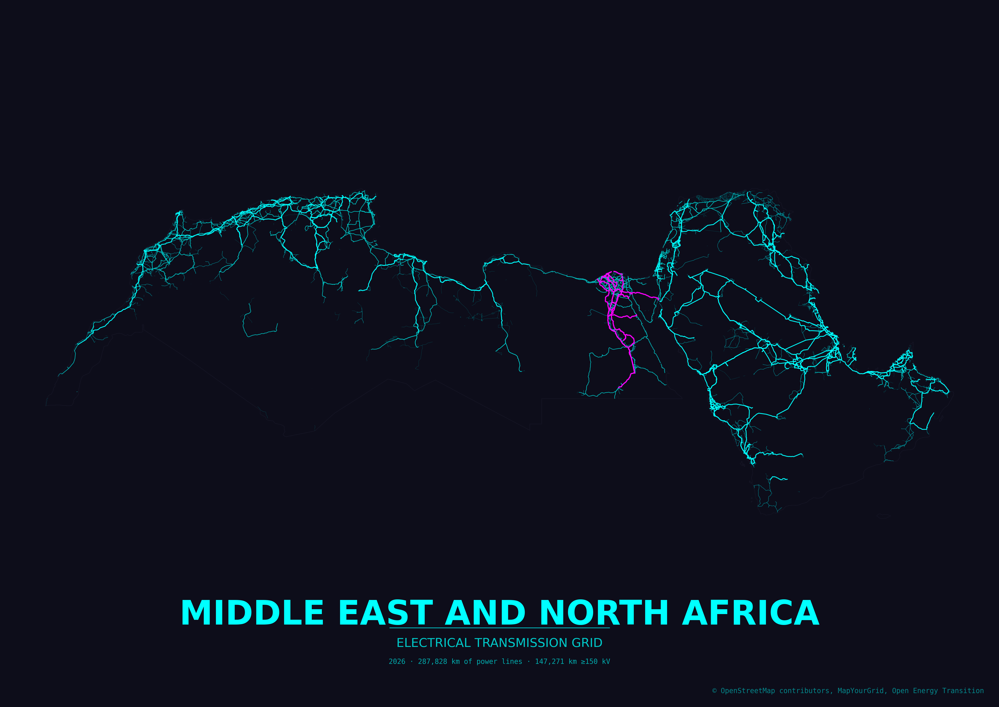

<h1 align="center">Grid2Poster</h1>

<p align="center">
  Generate print-ready posters of electrical grid infrastructure from OpenStreetMap data.
  Browse the rendered posters in the <a href="https://open-energy-transition.github.io/grid2poster/">online gallery</a>.
  Transmission lines for a country or continent are downloaded and rendered with GeoPandas, OSMnx, and Matplotlib. The project is heavily inspired and reused styling from <a href="https://github.com/originalankur/maptoposter">maptoposter</a>.
</p>

<p align="center">
  
  
</p>

<p align="center"> Grid2Poster supports countries, states, provinces and continents, as well as predefined regions.</p>

## Data

Grid2Poster uses OpenStreetMap features tagged as:

- `power=line`
- `power=minor_line` when enabled
- `power=cable` when enabled

Feature completeness depends on OpenStreetMap coverage in the selected country or region.

### Contributing to the data

Coverage and quality in your country can be improved by mapping transmission infrastructure directly in OpenStreetMap. [MapYourGrid](https://mapyourgrid.org) is a community initiative that coordinates this work. It provides tutorials, country-level completeness/quality statistics and mapping tools for tracing power lines, generators and substations from imagery. With [Open Infrastructure Map](https://openinframap.org/) you can browse all the electrical grid data data in OpenStreetMap.S 

## Installation

The project lives in two branches: the main branch and the gh-pages branch. To create your own posters, clone the main branch with the --single-branch flag, as the gh-pages branch contains all the gallery plots and is therefore massive.
```bash
git clone --single-branch https://github.com/open-energy-transition/grid2poster 
python -m venv .venv
source .venv/bin/activate
pip install -r requirements.txt
```

## Usage

By default every run writes both a PNG and an SVG:
```bash
python create_grid_poster.py --country Portugal
```

For large countries, reduce the Overpass query tile size:
```bash
python create_grid_poster.py --country Vietnam --tile-size-km 150
```

Include distribution grids if available. Coverage various significatly across the globe:
```bash
python create_grid_poster.py --country Germany --include-minor-lines
```

List available themes. Create a new theme JSON file in the 'themes' directory to find your own style.
```bash
python create_grid_poster.py --list-themes
```

Use a local GeoJSON file as the boundary instead of geocoding (handy for custom regions or sub-national areas). All polygonal features in the file are dissolved into a single boundary. The `--country` value is still used for the poster title and output filename. `--landscape` will render in landscape (horizontal) orientation.
```bash
python create_grid_poster.py --country "Middle East and North Africa" --boundary-geojson ./regions/mena.geojson --landscape --theme neon_cyberpunk 
```



Render an entire continent. Continent boundaries come from the Natural Earth admin-0 dataset (downloaded and cached on first use) because Nominatim does not resolve continent names. Accepted values are `Africa`, `Antarctica`, `Asia`, `Europe`, `North America`, `Oceania`, and `South America`. The aggregate name `Global` combines every inhabited continent.

```bash
python create_grid_poster.py --country Africa --tile-size-km 500
```

Continent-scale runs hit the Overpass API hundreds of times and can take several hours. A larger `--tile-size-km` cuts the number of queries; pick a value that still stays under the Overpass per-query size limit.

If the default Overpass endpoint (`overpass-api.de`) is rate-limiting or refusing connections, switch to a mirror with `--overpass-endpoint`:
```bash
python create_grid_poster.py --country Germany --overpass-endpoint https://overpass.kumi.systems/api/interpreter
```
Other public mirrors include `https://overpass.private.coffee/api/interpreter`.


## Options

| Option | Default | Description |
| --- | --- | --- |
| `--country` | - | Country or region name resolvable by Nominatim, a continent name (`Africa`, `Antarctica`, `Asia`, `Europe`, `North America`, `Oceania`, `South America`), or the aggregate `Global`  |
| `--boundary-geojson` | - | Path to a local GeoJSON file with polygonal boundary features. Overrides the Nominatim/Natural Earth lookup. Useful for custom regions, sub-national areas, or offline workflows. |
| `--display-country` | value of `--country` | Text to print on the poster. Useful when the geocoder name differs from the desired title. |
| `--subtitle` | `ELECTRICAL TRANSMISSION GRID` (or `ELECTRICAL GRID` with `--include-minor-lines`) | Override the subtitle printed under the country/region name. |
| `--padding` | `0.10` | Fractional padding around the boundary bounds. Lower values zoom in (`0` = tight fit, `-0.05` = crop slightly into the bounds); higher values pull the view out. |
| `--theme` | `paper_grid` | Theme ID from the `themes/` directory. |
| `--list-themes` | - | List available themes and exit. |
| `--include-minor-lines` | off | Also fetch `power=minor_line` features. |
| `--include-cables` / `--no-include-cables` | on | Fetch `power=cable` features (underground/submarine). On by default; pass `--no-include-cables` to skip. |
| `--cable-sea-buffer-km` | `200.0` | When `--include-cables` is on, inflate the boundary by this many kilometers over water so submarine cables between islands and to neighboring countries are queried from Overpass and survive coastline clipping. Set to `0` to disable. |
| `--include-outlying` | off | Keep overseas territories and other polygons far from the main landmass. By default the geocoded boundary is filtered to the mainland (and nearby islands), so posters for countries like the Netherlands or France do not include Aruba, Curaçao, French Guiana, etc. |
| `--paper-size` | - | Named preset, portrait orientation. Overrides `--width`/`--height`. Choices: `a5`, `a4`, `a3`, `a2`, `a1`, `a0`, `letter`, `legal`, `tabloid`. Combine with `--landscape` to flip. |
| `--width` | `297.0` | Poster width in millimeters (default: A3 short side). |
| `--height` | `420.0` | Poster height in millimeters (default: A3 long side). |
| `--landscape` | off | Render in landscape (horizontal) orientation. Swaps width and height if width < height. |
| `--dpi` | `300` | Raster output DPI (applies to PNG output). |
| `--title-size` | auto | Title font size in points. Auto-scaled from poster size by default; set to override. |
| `--tile-size-km` | `200` | Overpass query tile size in kilometers. Use smaller values for very large countries or busy servers. |
| `--overpass-endpoint` | OSMnx default (`overpass-api.de`) | Override the Overpass API URL. Use a mirror (e.g. `https://overpass.kumi.systems/api/interpreter`) when the default is rate-limiting or unreachable. |
| `--format` | `png svg` | Output format(s): any combination of `png`, `svg`, `pdf`. Multiple values are written in one run. |
| `--output` | auto-generated in `posters/` | Output file path. When set, only a single file is written and its format is inferred from the extension. |
| `--crs` | `EPSG:3857` | Projection used for rendering. EPSG:3857 (Pseudo-Mercator) works well for country posters. |
| `--hide-metadata` | off | Do not print segment counts on the poster. |
| `--export-geojson` | off | Also save all transmission lines as a single GeoJSON in WGS84 (EPSG:4326). Pass a path to override the default location in `posters/`. |
| `--verbose-osmnx` | off | Print OSMnx request logs. |

## Output

Generated posters are written to the `posters/` directory by default. Intermediate OSM responses and processed geometries are cached in `cache/` to avoid repeated downloads.


## Gallery

| Poster | Country | Theme |
| --- | --- | --- |
|  | China | `paper_grid` |
|  | South America | `japanese_ink` |
|  | India | `japanese_ink` |
|  | Pakistan | `electric_midnight` |
|  | Vietnam | `midnight_blue` |
|  | California | `warm_beige` |
|  | Mexico | `forest` |
|  | Italy | `autumn` |
|  | Zambia | `sunset` |
|  | Morocco | `autumn` |
|  | Latin America | `emerald` |

### Predefined regions

The `regions/` directory ships with multi-country boundaries that map to common power-system groupings. Pass any of them via `--boundary-geojson` and set `--country` to the title you want printed on the poster:

```bash
python create_grid_poster.py --country "Europe" --boundary-geojson ./regions/europe.geojson --tile-size-km 300
```

| File | Coverage |
| --- | --- |
| `regions/australia_mainland_tasmania.geojson` | Australia: mainland and Tasmania; outlying territories excluded. |
| `regions/britain_and_ireland.geojson` | Great Britain (excl. Shetland) and the island of Ireland. |
| `regions/canada_southern_provinces.geojson` | Canada south of 60°N; excludes Yukon, NWT, Nunavut. |
| `regions/central_asia.geojson` | Kazakhstan, Kyrgyzstan, Tajikistan, Turkmenistan, Uzbekistan. |
| `regions/east_africa.geojson` | 11 East African countries from Eritrea/Djibouti south to Tanzania. |
| `regions/europe.geojson` | 35 European countries including UK, Ireland, Nordics, Turkey, and Ukraine; excludes Russia and Belarus. |
| `regions/iberia.geojson` | Spain and Portugal. |
| `regions/ireland_island.geojson` | Island of Ireland (Republic of Ireland + Northern Ireland). |
| `regions/japan_main_islands.geojson` | Japan's four main islands plus adjacent small islands; excludes Okinawa, Ogasawara, Senkaku. |
| `regions/latin_america.geojson` | 48 entries from Mexico through Argentina, including the Caribbean and overseas territories. |
| `regions/mediterranean.geojson` | 22 countries bordering the Mediterranean. |
| `regions/mena.geojson` | Middle East and North Africa — 18 countries. |
| `regions/scandinavia.geojson` | Denmark, Finland, Norway, Sweden. |
| `regions/south_africa_no_prince_edward.geojson` | South Africa mainland; excludes Prince Edward Islands. |
| `regions/south_asia.geojson` | India, Pakistan, Bangladesh, Nepal, Bhutan, Sri Lanka. |
| `regions/southeast_asia.geojson` | 11 Southeast Asian countries (Brunei through Vietnam). |
| `regions/uk_no_shetland.geojson` | United Kingdom without the Shetland Islands. |
| `regions/us_canada_mainland.geojson` | Continental US and Canadian mainland south of 60°N; excludes Alaska, Hawaii, Arctic islands. |
| `regions/wapp.geojson` | West African Power Pool — 14 member countries. |

For ad-hoc areas (a single state, a metro region, a custom polygon), supply your own GeoJSON via `--boundary-geojson`. All polygonal features in the file are dissolved into one boundary.

### Contributing posters

The [online gallery](https://open-energy-transition.github.io/grid2poster/) is served from the orphan `gh-pages` branch, which has no shared history with `main`. The install instructions above use `--single-branch main` and therefore do **not** fetch it.Fetch it explicitly the first time you contribute:

```bash
git fetch origin gh-pages
```

To add a poster:

1. Render it from `main` with `create_grid_poster.py`. 
   ```bash
   python create_grid_poster.py --country Spain --theme paper_grid
   ```
2. Move the PNG (and SVG, if you want to offer the vector download) out of `posters/` so it survives the branch switch, then switch to `gh-pages`:
   ```bash
   mv posters/spain_grid_paper_grid_*.png /tmp/
   git checkout gh-pages
   mv /tmp/spain_grid_paper_grid_*.png posters/
   ```
3. Rebuild the manifest and commit:
   ```bash
   python build_manifest.py
   git add posters/ 
   git commit -m "Add Spain (paper_grid)"
   ```
4. Open a pull request targeting `gh-pages` (not `main`).

## Attribution

Map data © OpenStreetMap contributors.

