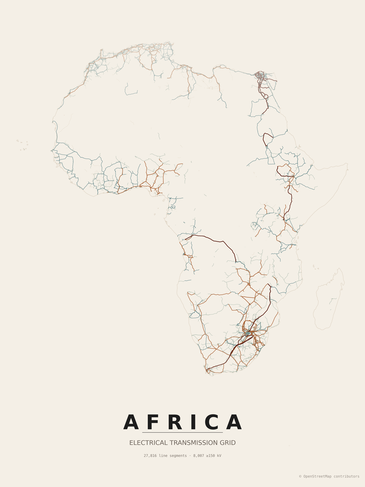

<h1 align="center">Grid2Poster</h1>

<p align="center">
  Generate print-ready posters of electrical grid infrastructure from OpenStreetMap data.<br/>
  Transmission lines for a country or continent are downloaded and rendered with GeoPandas, OSMnx, and Matplotlib. The project is heavily inspired and reused styling from <a href="https://github.com/originalankur/maptoposter">maptoposter</a>.
</p>

<p align="center">
  
  
</p>

<p align="center"> Grid2Poster supports countries, states, provinces and continents, as well as optional administrative boundaries.</p>

## Data

Grid2Poster uses OpenStreetMap features tagged as:

- `power=line`
- `power=minor_line` when enabled
- `power=cable` when enabled

Feature completeness depends on OpenStreetMap coverage in the selected country or region.

### Contributing to the data

Coverage and quality in your country can be improved by mapping transmission infrastructure directly in OpenStreetMap. [MapYourGrid](https://mapyourgrid.org) is a community initiative that coordinates this work. It provides tutorials, country-level completeness/quality statistics and mapping tools for tracing power lines, generators and substations from imagery.

## Installation

```bash
python -m venv .venv
source .venv/bin/activate
pip install -r requirements.txt
```

## Usage

```bash
python create_grid_poster.py --country Germany
```

For large countries, reduce the Overpass query tile size:

```bash
python create_grid_poster.py --country France --tile-size-km 150
```

Export as SVG or PDF for vector workflows:

```bash
python create_grid_poster.py --country Spain --format svg
python create_grid_poster.py --country Poland --format pdf
```

Include additional infrastructure layers:

```bash
python create_grid_poster.py --country Germany --include-minor-lines --include-cables
```

List available themes:

```bash
python create_grid_poster.py --list-themes
```

Use a local GeoJSON file as the boundary instead of geocoding (handy for custom regions or sub-national areas):

```bash
python create_grid_poster.py --country "Bavaria" --boundary-geojson ./regions/bavaria.geojson
```

All polygonal features in the file are dissolved into a single boundary. The `--country` value is still used for the poster title and output filename.

Render an entire continent. Continent boundaries come from the Natural Earth admin-0 dataset (downloaded and cached on first use) because Nominatim does not resolve continent names. Accepted values are `Africa`, `Antarctica`, `Asia`, `Europe`, `North America`, `Oceania`, and `South America`:

```bash
python create_grid_poster.py --country Africa --tile-size-km 500
```

Continent-scale runs hit the Overpass API hundreds of times and can take several hours. A larger `--tile-size-km` cuts the number of queries; pick a value that still stays under the Overpass per-query size limit.

Export the rendered transmission lines as GeoJSON (WGS84) alongside the poster, for reuse in GIS tools:

```bash
python create_grid_poster.py --country Germany --export-geojson
python create_grid_poster.py --country Germany --export-geojson data/germany_grid.geojson
```

Without a path, the file is written to `posters/` next to the poster. The export is a single FeatureCollection of all fetched lines reprojected to EPSG:4326.

## Options

| Option | Default | Description |
| --- | --- | --- |
| `--country` | — | Country or region name resolvable by Nominatim, or a continent name (`Africa`, `Antarctica`, `Asia`, `Europe`, `North America`, `Oceania`, `South America`). |
| `--boundary-geojson` | — | Path to a local GeoJSON file with polygonal boundary features. Overrides the Nominatim/Natural Earth lookup. Useful for custom regions, sub-national areas, or offline workflows. |
| `--display-country` | value of `--country` | Text to print on the poster. Useful when the geocoder name differs from the desired title. |
| `--theme` | `electric_midnight` | Theme ID from the `themes/` directory. |
| `--list-themes` | — | List available themes and exit. |
| `--include-minor-lines` | off | Also fetch `power=minor_line` features. |
| `--include-cables` | off | Also fetch `power=cable` features. |
| `--include-outlying` | off | Keep overseas territories and other polygons far from the main landmass. By default the geocoded boundary is filtered to the mainland (and nearby islands), so posters for countries like the Netherlands or France do not include Aruba, Curaçao, French Guiana, etc. |
| `--width` | `12.0` | Poster width in inches. |
| `--height` | `16.0` | Poster height in inches. |
| `--dpi` | `300` | Raster output DPI (applies to PNG output). |
| `--tile-size-km` | `200` | Overpass query tile size in kilometers. Use smaller values for very large countries or busy servers. |
| `--format` | `png` | Output format: `png`, `svg`, or `pdf`. |
| `--output` | auto-generated in `posters/` | Output file path. |
| `--crs` | `EPSG:3857` | Projection used for rendering. EPSG:3857 (Pseudo-Mercator) works well for country posters. |
| `--hide-metadata` | off | Do not print segment counts on the poster. |
| `--export-geojson` | off | Also save all transmission lines as a single GeoJSON in WGS84 (EPSG:4326). Pass a path to override the default location in `posters/`. |
| `--verbose-osmnx` | off | Print OSMnx request logs. |

## Output

Generated posters are written to the `posters/` directory by default. Intermediate OSM responses and processed geometries are cached in `cache/` to avoid repeated downloads.

## Notes

The script uses the public Overpass API through OSMnx. Large requests may fail or be rate-limited. Use smaller `--tile-size-km` values for large countries or when the Overpass server is busy.

The map is intended for visualisation and print design. It should not be used as an authoritative grid model.

## Gallery

| Poster | Country | Theme |
| --- | --- | --- |
|  | India | `paper_grid` |
|  | India | `japanese_ink` |
|  | Pakistan | `electric_midnight` |
|  | Vietnam | `midnight_blue` |
|  | California | `warm_beige` |
|  | Mexico | `forest` |
|  | Italy | `autumn` |
|  | Zambia | `sunset` |
|  | Morocco | `autumn` |
|  | Nigeria | `paper_grid` |
|  | Nigeria | `neon_cyberpunk` |
|  | Japan | `paper_grid` |


## Attribution

Map data © OpenStreetMap contributors.

